# 2023 새싹톤(SeSACTHON) - 쉐이퍼즈

## 🚂 무턱대고 🚂

> 무턱대고는 **교통약자 문제** 를 해결을 위한 앱 입니다.
 

### 🚀 개발기간 2023.05.24 ~ 2023.06.15

## 💡서비스 소개
2020년 보건복지부 통계에 따르면 등록 장애인 수는 약 260만명에 이르고 
이 숫자의 10명 중 한 명이 휠체어 등의 이동보조장치를 이용하는 장애인입니다. 
26만명의 장애인들에게 지하철 이용은 매우 어렵습니다. 
2023년 초에는 언론도 하루가 멀다 다뤘던 
큰 규모의 시위와 지하철 점거 이슈가 있었습니다. 
사회적 비용만 4550억 규모로 추정되고 
출근이나 등교 및 중요한 약속에 늦어 직 간접적으로 피해를 입은 사람만 1210만명에 달합니다. 
쉐이퍼즈는 장애인의 관점에서, 장애인을 위해 설계된 어플리케이션을 통해 지하철 이용 경험을 개선하기로 계획했습니다.
 
 

## 👨‍👩‍👧‍👦 팀 소개

 
 

## 🛠️ 아키텍처
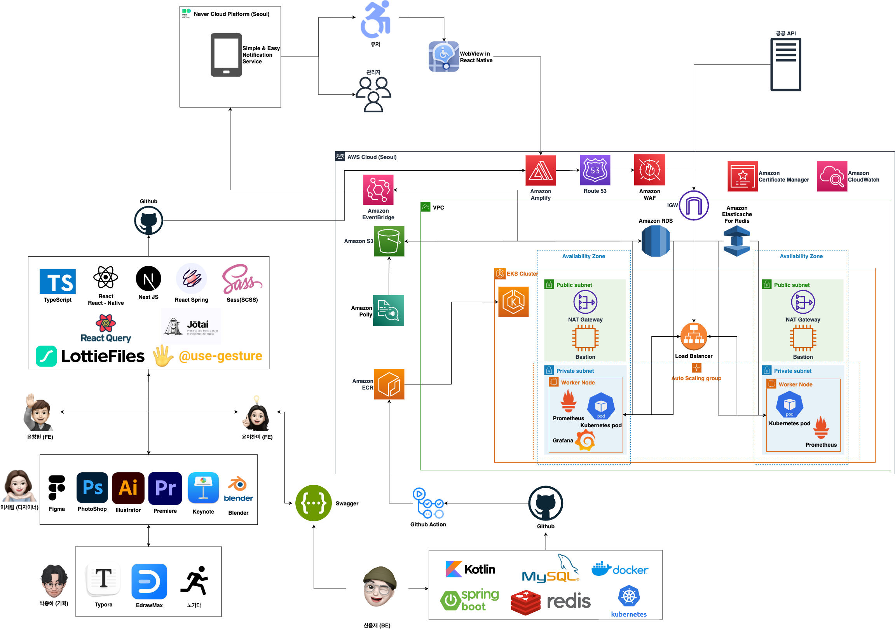
 
 

### 📍 주요기능
1. **정확한 양질의 정보 부재**
   - 실시간 열차 운행정보, 장애인 전용 환승정보 제공
2. **고려되지 않은 유저 접근성**
    - 자동 안내 네비게이션, AI기반 음성 안내
3. **시설물 가용성 확인 불가**
   - 공공 API와 집단지성을 통한 시설물 실시간 가용성 판단 가능
4. **역사 내 경로 탐색의 어려움**
    - 3D 지도로 확인하는 역사 내 길찾기
5. **불편한 민원 신고 방식**
    - 각종 시설물 고장신고 및 역무원 호출 인앱 자동화

### 🔐 문제해결 과정
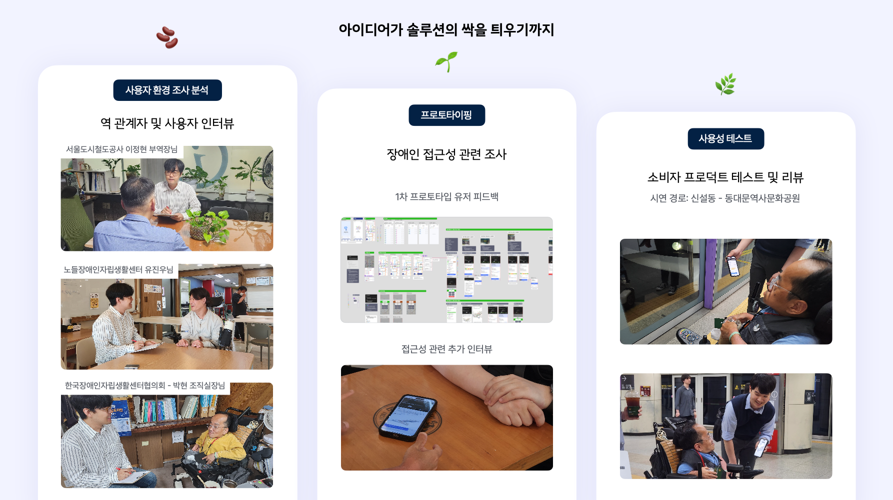
 
 

### 📱미리보기
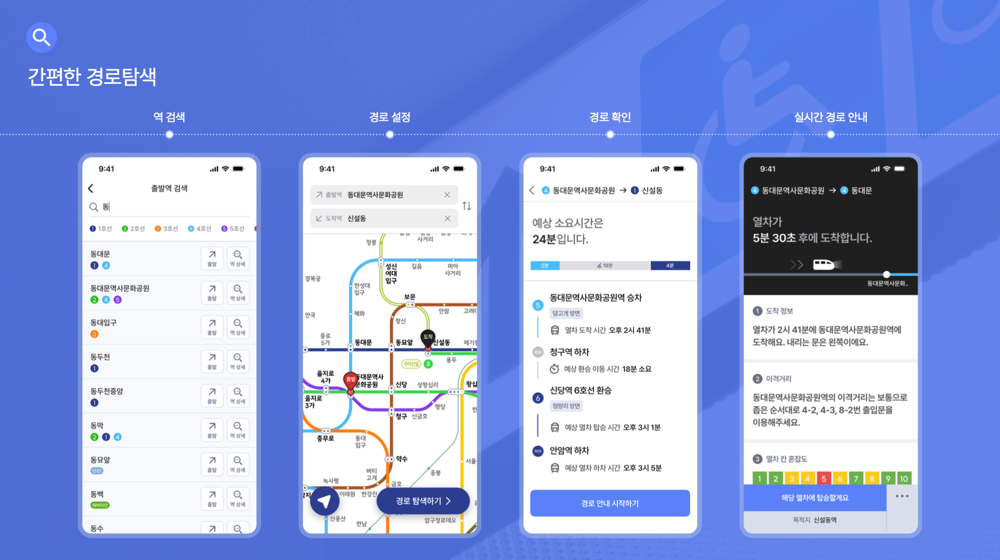
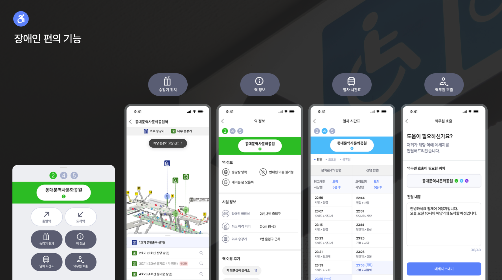
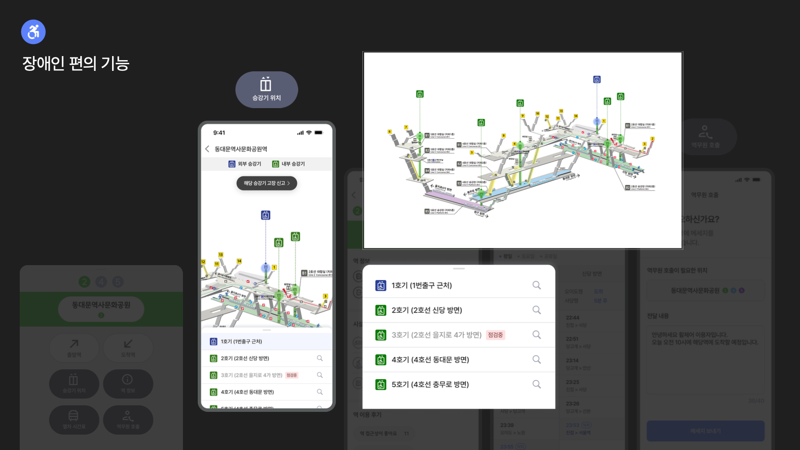
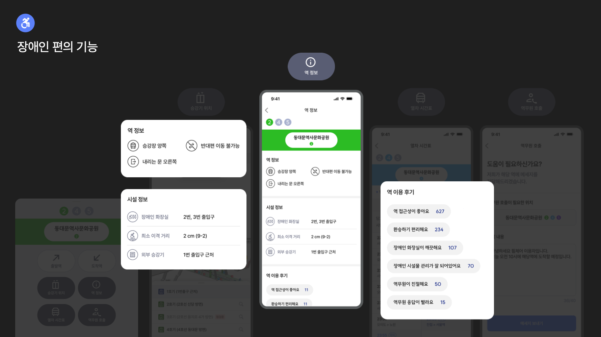
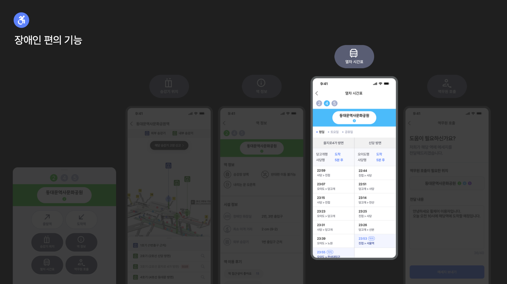
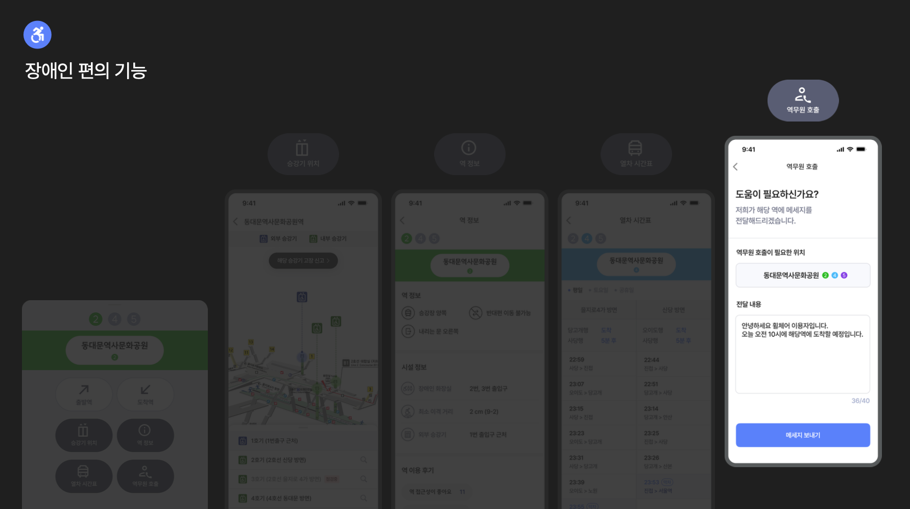
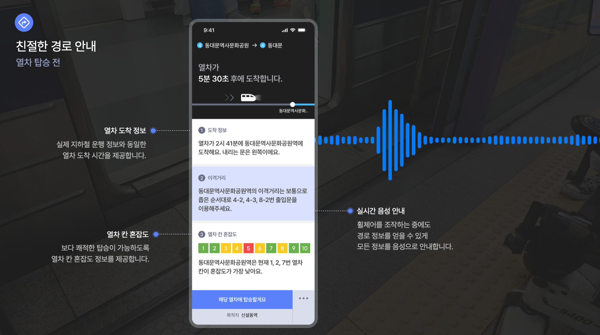
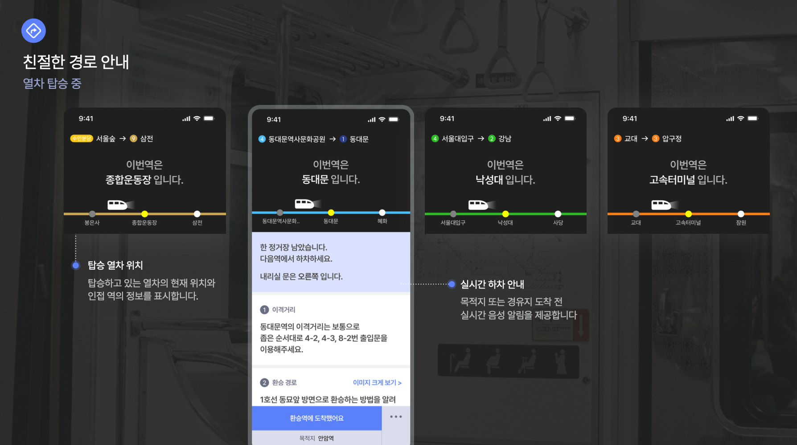
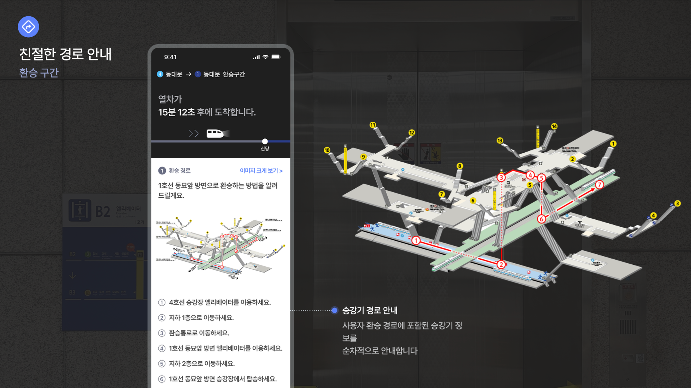
